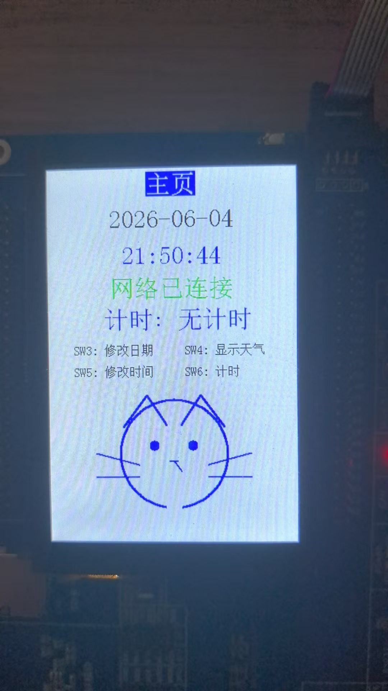
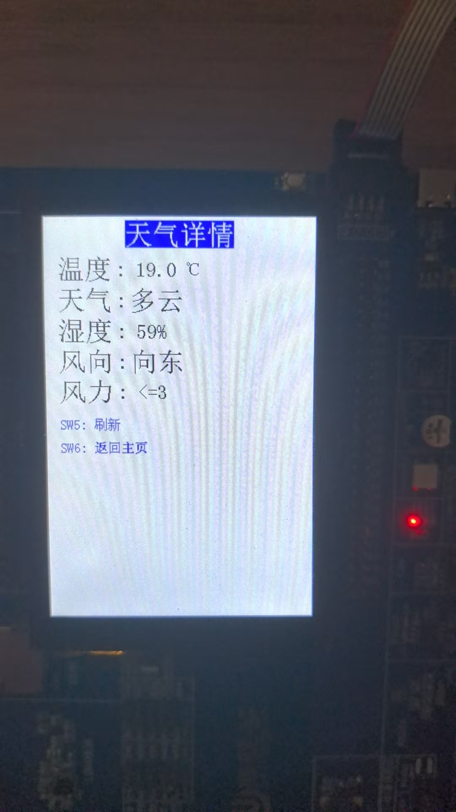
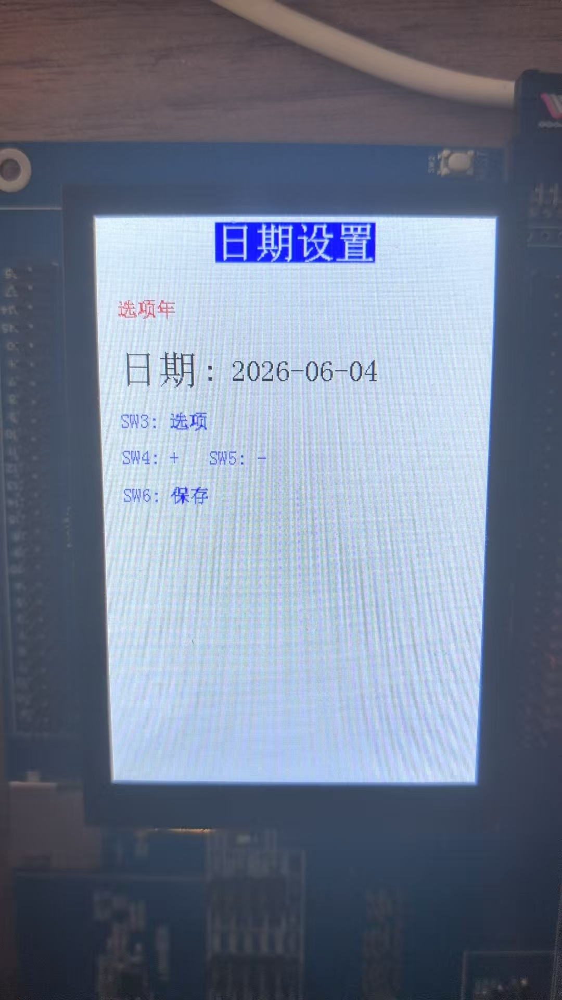
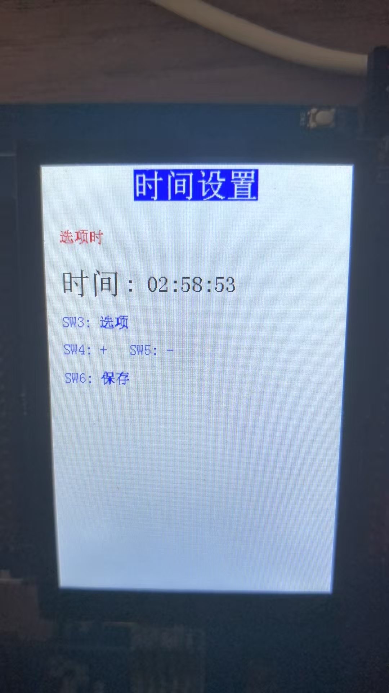
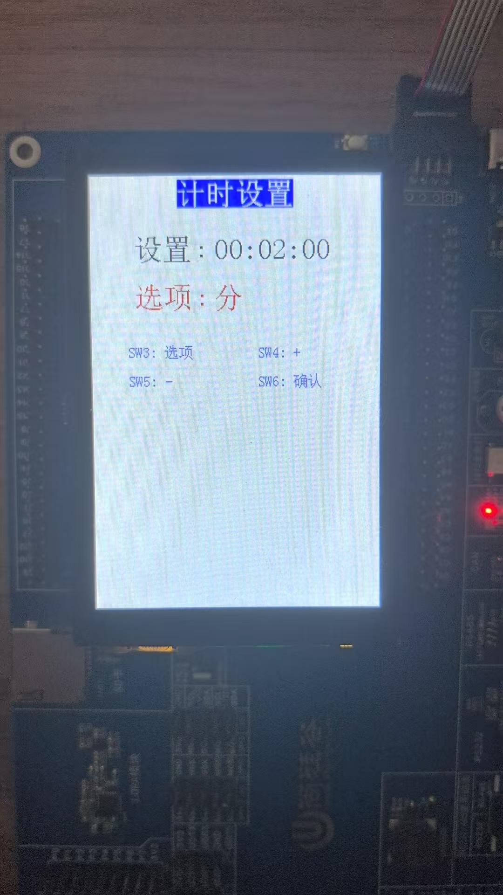
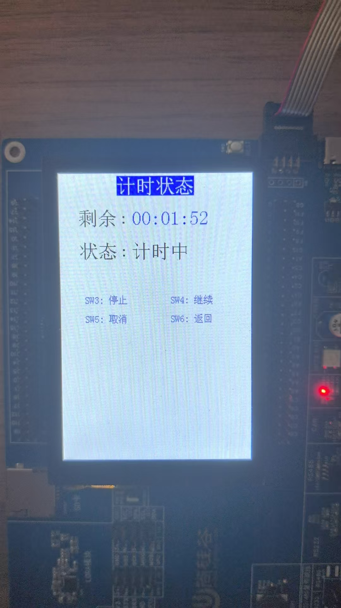
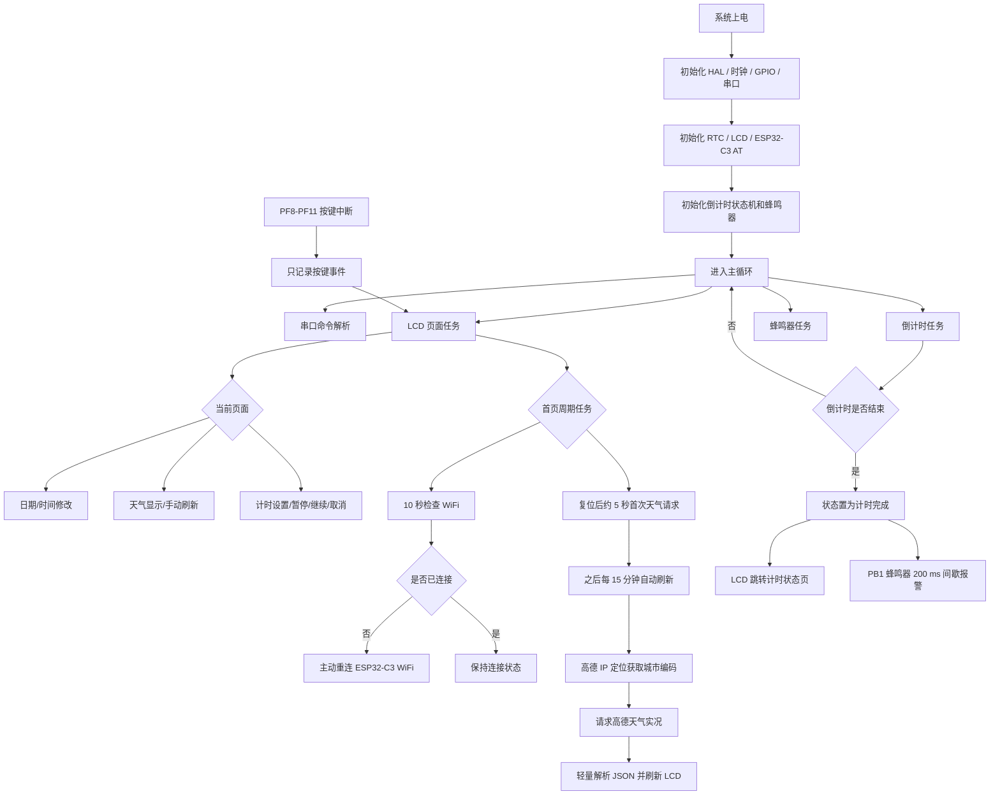

# STM32 + ESP32-C3 联网天气时钟

一个基于 STM32F103ZE 的 LCD 中文多级菜单项目，集成本地 RTC 时钟、联网天气显示、日期/时间设置、倒计时蜂鸣提醒等功能。项目适合作为嵌入式方向毕业设计参考，也可以作为嵌入式软件工程师校招简历项目的学习模板。

> 开发板基于尚硅谷 2024 STM32F103ZET6 扩展版，显示屏使用 FSMC LCD，联网模块使用 ESP32-C3 AT 固件。

## 项目效果

| 首页 | 天气详情 |
| --- | --- |
|  |  |

| 日期设置 | 时间设置 |
| --- | --- |
|  |  |

| 计时设置 | 计时状态 |
| --- | --- |
|  |  |

## 功能特性

- LCD 中文多级菜单：首页、日期设置、时间设置、天气详情、计时设置、计时状态等页面。
- RTC + BKP 实时时钟：支持本地日期时间显示、按键修改和掉电保持。
- ESP32-C3 AT 联网：通过 WiFi 获取高德天气实况数据。
- 自动 IP 定位 + 兜底城市：每次天气请求前先定位城市，定位失败时使用默认城市编码。
- 天气自动刷新：通过高德 IP 定位 API 获取城市编码，再调用高德天气 API 获取当地实况；复位后约 5 秒首次请求，之后每 15 分钟自动刷新一次，天气页也支持手动刷新。
- 倒计时提醒：支持 23:59:59 内的倒计时设置、暂停、继续、取消，时间到后 PB1 蜂鸣器间歇报警。
- 串口调试：支持 RTC、ESP32 AT、WiFi、天气、LCD、计时器等诊断命令。

## 硬件组成

| 模块 | 说明 |
| --- | --- |
| 主控 | STM32F103ZE |
| 显示 | FSMC LCD，使用自定义中文点阵字库 |
| 联网 | ESP32-C3，AT 固件，USART2 通信 |
| 时钟 | STM32 RTC + BKP 备份域 |
| 按键 | PF8-PF11，对应 SW3-SW6 |
| 蜂鸣器 | PB1，TIM3_CH4 PWM 输出 |
| 调试串口 | USART1 |

## 软件结构

```text
Core/Src
├── main.c              # 系统初始化、串口命令、RTC 基础逻辑
├── app_lcd_clock.c     # LCD 页面状态机、按键交互、页面绘制
├── app_wifi.c          # ESP32-C3 WiFi 入网与连接状态查询
├── app_weather.c       # 高德 IP 定位、天气请求与 JSON 轻量解析
├── app_countdown.c     # 倒计时业务状态机
├── bsp_buzzer.c        # PB1/TIM3_CH4 蜂鸣器 PWM 驱动
├── bsp_esp_at.c        # ESP32 AT 指令收发封装
└── app_debug_uart.c    # USART1 调试输出
```

核心逻辑采用裸机主循环方式组织：中断中只记录按键事件，主循环中统一处理页面跳转、RTC 写入、天气刷新、倒计时更新和蜂鸣器报警，避免在中断里执行耗时操作。

## 程序运行逻辑



按键中断只做事件记录，真正的页面跳转、联网请求、RTC 写入和蜂鸣器控制都在主循环中执行。

## 如何使用

1. 使用 Keil MDK 打开 `MDK-ARM/08_USART_HAL.uvprojx`。
2. 确认硬件连接与本项目一致，尤其是 ESP32-C3 串口、LCD、PF8-PF11 按键和 PB1 蜂鸣器。
3. 修改 WiFi 配置：

```c
// Core/Src/app_wifi.c
#define APP_WIFI_SSID      "你的WiFi名称"
#define APP_WIFI_PASSWORD  "你的WiFi密码"
```

4. 修改高德 Web 服务 Key 和兜底城市编码：

```c
// Core/Src/app_weather.c
#define APP_WEATHER_KEY            "你的高德Key"
#define APP_WEATHER_FALLBACK_CITY  "310000"
```

5. 编译并下载程序。上电后首页会先显示 RTC 时间，约 5 秒后自动尝试联网并获取天气。

## 按键说明

| 页面 | SW3 | SW4 | SW5 | SW6 |
| --- | --- | --- | --- | --- |
| 首页 | 修改日期 | 显示天气 | 修改时间 | 计时 |
| 日期/时间设置 | 切换选项 | 加 | 减 | 保存 |
| 天气详情 | - | - | 刷新 | 返回主页 |
| 计时设置 | 切换选项 | 加 | 减 | 确认 |
| 计时确认 | - | - | 开始 | 返回主页 |
| 计时状态 | 停止 | 继续 | 取消/关闭 | 返回/关闭 |

## 毕设与求职参考

- 毕业设计参考：本项目可作为“基于 STM32 的联网天气时钟系统”类课题模板，覆盖外设驱动、RTC 时间管理、联网通信、数据解析和 LCD 人机交互。
- 校招求职参考：本项目可作为嵌入式软件简历项目，突出 STM32 模块化开发、页面状态机、ESP32-C3 AT 联网、HTTP 数据获取和异常兜底处理能力。

## 适合继续完善的方向

- 将 WiFi、城市编码、刷新周期做成可配置参数，并保存到 Flash。
- 增加低功耗待机与按键/RTC 唤醒。
- 将菜单改造成表驱动结构，进一步提高页面扩展性。
- 引入 LVGL 或 TouchGFX，升级为更现代的 GUI 项目。
- 增加联网失败重试策略、天气缓存和错误页面。

## 说明

本仓库定位为学习与参考项目，代码尽量保留了调试信息和模块注释，方便阅读、复现和二次开发。用于简历或毕业设计时，建议结合自己的硬件改动、调试记录和扩展功能进行说明。
